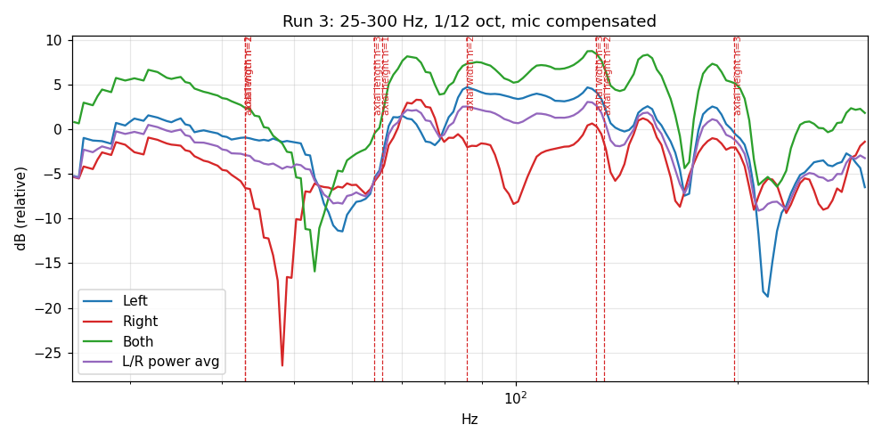
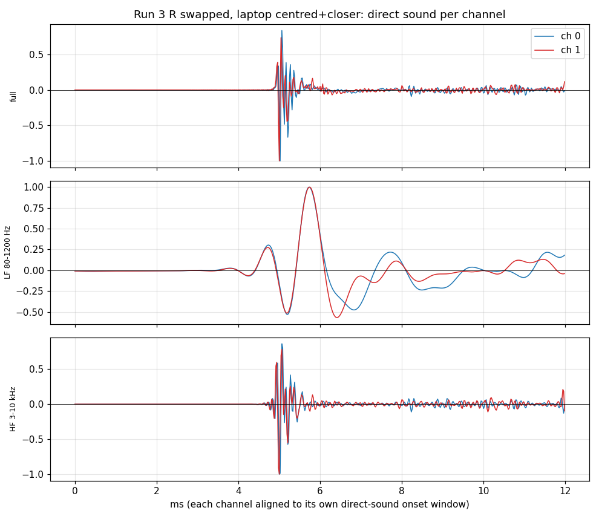
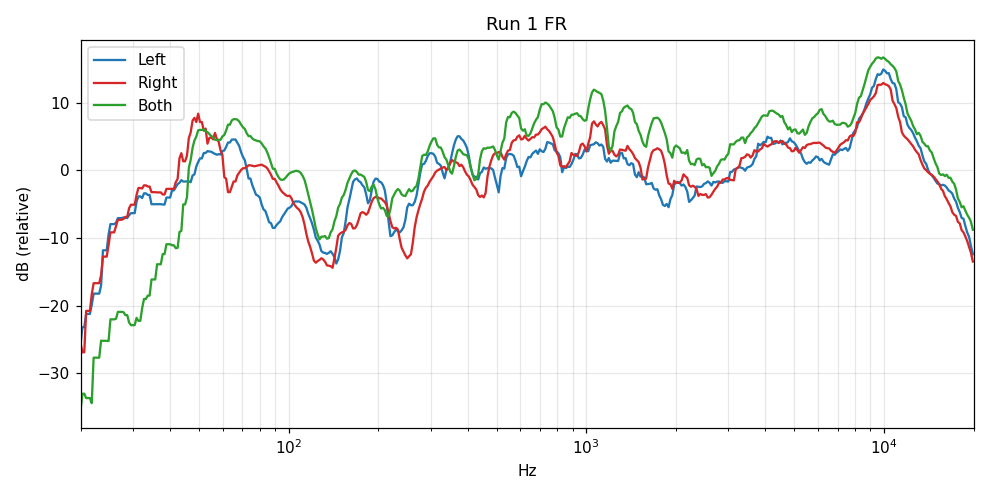

# auto_audio_assist

**Find what's wrong with your stereo, not what's imperfect about it.**

`auto_audio_assist` plays sine sweeps and bass bursts through your speakers, records them with
whatever microphone you have (a laptop mic is fine), and tells you about the setup problems that
actually ruin a system:

- a speaker wired with **+ and − swapped**
- a **tweeter/mid section reversed** relative to the woofer (bi-wire jumper or terminal mix-up)
- **left and right channels swapped** somewhere in the chain
- the handful of **room-mode peaks** that are worth cutting with EQ, and the dips that are not

Every stage produces hard numbers *and* a prompt with the evidence attached (JSON plus rendered
plots), so an LLM can double-check the algorithm and explain the result to a human standing in
the room with a screwdriver. Use the `claude` command-line tool, the Anthropic API, or any
OpenAI-compatible endpoint. Or run it with the LLM switched off.

It is a Python 3 + Tk application (numpy/scipy for the signal processing, matplotlib for the
report plots, PipeWire and ALSA for audio). Linux first; the design is cross-platform.



## Quick start

```bash
git clone https://github.com/qume/auto_audio_assist
cd auto_audio_assist
python3 run.py
```

Requirements: `python3-tk`, `numpy`, `scipy`, `matplotlib`; PipeWire tools (`pw-play`,
`pw-record`, `pw-dump`, `wpctl`) and/or `arecord`/`aplay`; `ffmpeg` is optional. For the
`claude-cli` backend install [Claude Code](https://claude.com/claude-code) and log in. No pip
packages beyond the scientific stack.

## What a session looks like

The window has a step list on the left, the current step in the middle, and an assistant/log pane
at the bottom where you can ask questions in context at any time.

1. **Setup** — choose the output that feeds your amplifier, the microphone, describe the speakers
   and room (dimensions, distance from mic to each speaker), and pick the LLM backend. Saved to
   `config.json` (git-ignored; it may hold an API key).
2. **Mic profile** — load the calibration file of a measurement mic (Dayton UMM-6, miniDSP
   UMIK-1, any REW-style `freq dB` text file, or the tool's JSON), or let the LLM research a rough
   curve for a laptop mic (cached under `mics/`). On Asahi Linux laptops the raw mic array is read
   directly, bypassing the beamformer and its 120 Hz high-pass.
3. **Level check** — noise floor, pink noise, per-band signal-to-noise. Judged relative to your
   room's noise so an insensitive laptop mic is fine. **Identify channels** plays the LEFT channel
   only so you can confirm by ear which speaker is which.
4. **Measure** — about 40 s: a warm-up burst, then sweep left, sweep right, sweep both, then
   alternating in-phase / anti-phase 40–150 Hz noise bursts. Deconvolution yields one impulse
   response per speaker. The warm-up is not optional padding: AV receivers and network renderers
   mute or ramp for up to a second after a stream starts, which silently swallows the low end of
   whichever sweep comes first, and leading with silence does not wake them.
5. **Polarity** — verdicts and the evidence behind them, with an LLM review on request. Change a
   wire, re-measure, and the run comparison table shows what changed.
6. **Room modes** — peaks against a one-octave trend, matched to the axial modes predicted from
   your room dimensions; deep dips flagged as un-EQ-able; octave-band balance. The LLM suggests
   physical changes first. Loop until you are happy, then accept the corrections.
7. **Export** — Equalizer APO / EasyEffects text, a PipeWire **Room EQ** virtual sink installed
   either on the source computer or **on a remote PipeWire box over ssh** (the Pi that feeds the
   amp), and LLM-written guidance for your amp's EQ, an external DSP, or software on macOS/Windows.
   The Room EQ sink can also **fix problems in the stream**: invert one channel's polarity and
   delay the nearer channel to time-align the pair, alongside the parametric EQ.

### How the polarity checks work

| Test | What it measures | Robust to |
|---|---|---|
| Band-wise cross-correlation | Sign of the correlation between the two speakers' direct sound in 80–1200 Hz, 800–2500 Hz and 3–10 kHz after aligning onsets | mic being off-centre, unknown latency |
| Low-frequency sum test | Level of the both-speakers sweep vs the power sum of the single sweeps at 25–70 Hz (+3 dB in phase, deep loss if reversed) | mic position (wavelengths are metres long) |
| Burst test | In-phase vs anti-phase 40–150 Hz bursts | needs a roughly centred mic |
| Crossover notch | Dip in each speaker's direct-sound response between 800 Hz and 8 kHz | identifies which speaker has a reversed HF section |
| Run-to-run comparison | Which channel and which band flipped since the previous run | pins the culprit after a wiring change |
| Sweep level check | Band levels taken straight from the recording during each sweep | independent of IR extraction; catches a muting receiver or dynamic EQ before they mislead a verdict |

Whole-speaker reversal flips all three bands and the sum test. A reversed tweeter/mid section
flips only the upper bands while the bass tests stay positive.



## Getting sound to the speakers

The source computer is often nowhere near the amplifier. Setup offers:

- any **PipeWire sink** on the computer
- **ssh** to a remote Linux box that feeds the amp (a headless Raspberry Pi, say): the remote
  device field takes an ALSA device (`default`, `hw:0,0`) or a PipeWire node (`pw:raop-marantz`,
  played with `pw-play`). *Install system-wide sink for it* creates a PipeWire sink "Amp via host"
  plus a user service that streams it over ssh, so the remote box becomes an ordinary system output
- **manual / sneakernet**: export the test WAV, play it from anything, the app only records

The **microphone** can also live on the remote box (`ssh:user@host:hw:CARD,DEV`), which is the
natural arrangement when a USB measurement mic reaches further than the computer does. Remote
captures run for a fixed duration and stream back over ssh.

Playback latency does not matter. The analysis finds the first sweep wherever it lands in the
recording, and relative timing between channels is preserved because everything is one file.

### Correcting at the receiver

If a PipeWire box sits between every source and the amplifier (here: a Raspberry Pi that takes
Bluetooth via BlueALSA and Spotify Connect via librespot and sends AirPlay to a Marantz), the
right place for the correction is there. *Install Room EQ on remote box* writes
`~/.config/pipewire/pipewire.conf.d/60-aaa-room-eq.conf` on the box, restarts its user PipeWire,
and makes the Room EQ sink the default, so `bluealsa-aplay --pcm=pipewire`, librespot and anything
else that follows the default sink is corrected before it leaves for the amp. The chain is one
independent path per channel: optional `invert`, optional `delay`, then `bq_peaking` stages.
*Remove from remote box* deletes it and restores the previous default sink.

## Command line

```bash
python3 -m aaa.cli --sink ssh:user@host:default --source alsa:hw:CARD,0 \
    --dist 3 3 --dims 8 4 2.6 --session sessions/living-room --label "after jumper fix" [--llm]
```

Re-using `--session` appends a run and prints the comparison table plus the per-channel
change since the previous run.

## Repeatability

Test signals are deterministic (fixed seeds), the analysis is pure numpy/scipy, and every run
writes `sessions/<timestamp>/runNN/` with the stimulus, the recording, `evidence.json`, the PNG
plots, and every LLM prompt and response under `sessions/<timestamp>/llm/`. Prompts pass numbers
as JSON, state the algorithmic verdict, and demand a fixed JSON schema back, so different people
running the same room get the same conclusions from the same evidence.

## A real session

First run in the author's room, laptop 4.5 m away: all three correlation bands negative and the
both-speakers sweep 10 dB *below* a single speaker at 30 Hz.



| Run | Wiring | Correlation sign LF / mid / HF | LF sum test | Verdict |
|---|---|---|---|---|
| 1 | as found | −1 / −1 / −1 | −10.3 dB | reversed |
| 2 | right speaker +/− swapped at amp | +1 / +1 / +1 | +2.7 dB | in phase |
| 3 | same, laptop centred | +1 / +1 / +1 (corr 0.88–0.96) | +2.7 dB | in phase |
| 4 | left speaker HF section deliberately reversed | +1 / −1 / −1 | +2.7 dB | HF section reversed, left |

## Layout

```
run.py            launch the GUI
aaa/signals.py    deterministic test signals (N channels)
aaa/analysis.py   deconvolution, polarity tests, room modes, run comparison
aaa/audio_io.py   device discovery, play/record (PipeWire, ALSA, ssh, manual), remote sink
aaa/llm.py        claude CLI / Anthropic API / OpenAI-compatible backends, JSON extraction
aaa/prompts.py    prompt templates
aaa/plots.py      Tk canvas plots and matplotlib PNGs
aaa/eqexport.py   APO/EasyEffects text, PipeWire filter-chain EQ sink
aaa/session.py    session directories, config, mic-profile cache
aaa/app.py        the Tk wizard
aaa/cli.py        command-line runner
tests/            simulated-room analysis test and GUI smoke test
```

## Status and limits

- Stereo in the UI; signals and analysis already handle N channels (`channels` in config).
- Laptop-mic profiles are LLM estimates. Treat anything below 30 Hz or above 8 kHz as
  indicative until you use a calibrated microphone (which is fully supported: choose flat).
- Multi-capsule laptop arrays use one capsule; averaging would smear the treble band.
- The EQ exporters are tested on synthetic corrections; real rooms so far produced dips, not
  peaks, which EQ cannot fix.

## Development

```bash
python3 tests/sim_test.py     # synthetic room: good / reversed / tweeter-reversed cases
python3 tests/gui_smoke.py    # drives every wizard step with simulated audio (needs a display)
```

See [AGENTS.md](AGENTS.md) for conventions if you are extending it, human or otherwise.

## License

MIT, see [LICENSE](LICENSE).
